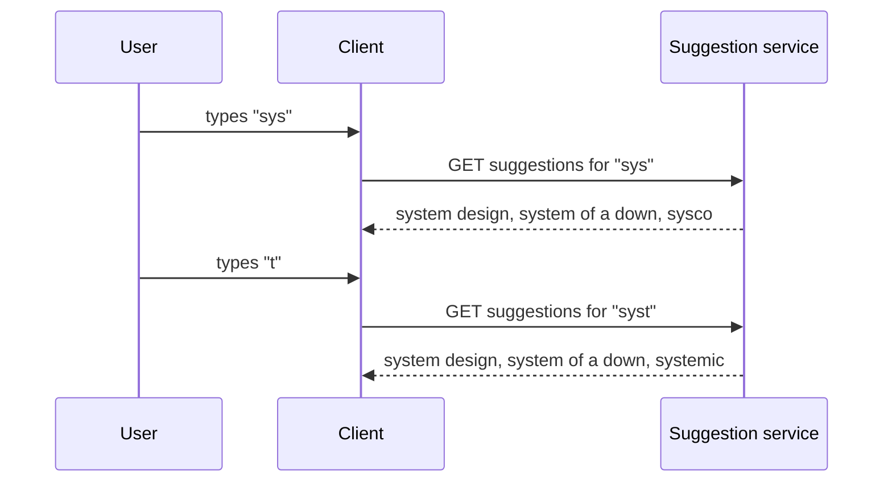

Typeahead, also called autocomplete, suggests completions as the user types into a search box. Type "how to b" and the box offers "how to boil eggs," "how to budget" and "how to become a pilot" before you finish. It saves keystrokes, helps users spell and phrase queries, and steers them towards searches that return good results.

## Why it is a distinct system

Typeahead looks like a small feature of search, but its workload is unusual:

- **A request per keystroke.** Every character typed can trigger a request, so typeahead receives several times more requests than the search engine itself.
- **Extreme latency requirements.** Suggestions must appear faster than the user types, within about 100 milliseconds end to end, or they feel laggy and useless. Server time must be a small fraction of that.
- **Prefix matching, not full-text search.** The input is a prefix of a query, and the output is the most popular queries starting with that prefix, which suits a specialized data structure rather than an inverted index.
- **Popularity changes.** Trending topics must appear in suggestions quickly, while stale or inappropriate suggestions must be removed.

## Two halves of the system

A typeahead system has two very different parts:

1. **The online serving path** answers prefix queries in milliseconds from an in-memory data structure, typically a **trie** with precomputed top suggestions at each node.
2. **The offline data pipeline** collects the queries users actually submit, aggregates their frequencies, applies filters and builds the data structure that the serving path loads.

Separating them is the key design decision: the serving path is read-only and blazing fast, while all the heavy computation happens in batch or streaming jobs.

## What this chapter covers

1. **Requirements:** features and estimates.
2. **High-level design:** the serving path, the collection pipeline and how they connect.
3. **The trie:** how prefixes are stored and how top suggestions are precomputed.
4. **Detailed design:** partitioning, updating, caching and personalization.
5. **Evaluation:** latency, freshness, availability and trade-offs.

<Callout type="interview">
The trie is the heart of the typeahead interview. Be ready to explain why storing the top k suggestions at every node turns an expensive subtree search into a single lookup.
</Callout>

<Ponder question="Why not answer typeahead requests with the same inverted index that powers full search?">
An inverted index answers "which documents contain these words?" and ranks documents; typeahead needs "which popular *queries* start with these characters?", ranked by how often people search them, within a couple of milliseconds, a million times per second. Prefix lookups over a few hundred million queries map naturally onto a trie with precomputed answers, while an inverted index would need expensive prefix expansion and scoring on every keystroke.
</Ponder>

<KeyTakeaways>
- Typeahead suggests popular query completions for the prefix a user has typed.
- It receives a request per keystroke and must respond far faster than the user types.
- Prefix matching over popular queries suits a trie better than an inverted index.
- The system splits into a read-only, in-memory serving path and an offline pipeline that aggregates queries and builds the trie.
</KeyTakeaways>
