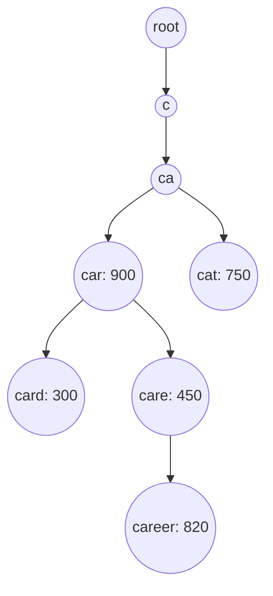
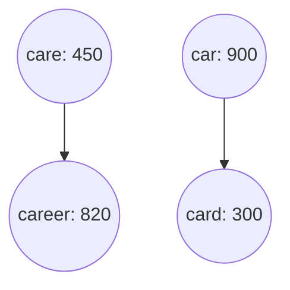
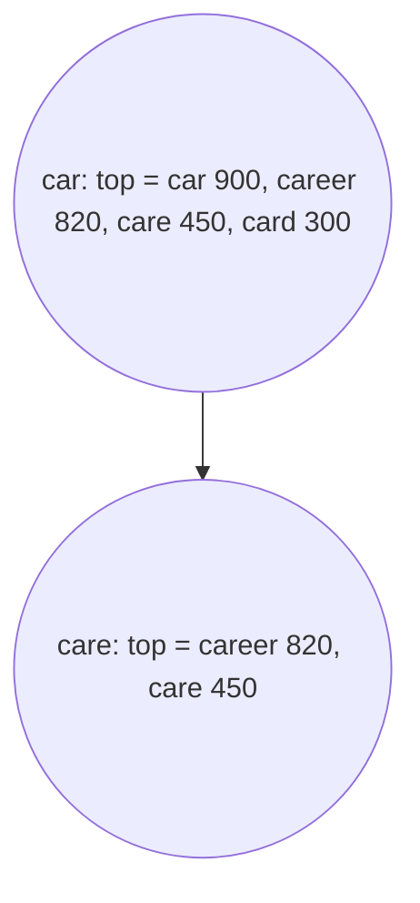
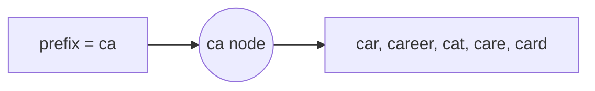
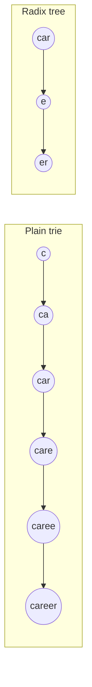

The trie, or prefix tree, is the data structure at the heart of typeahead. This lesson explains how it works, how to make lookups constant-time with precomputed suggestions, and how to keep it compact.

## The basic trie

A trie stores strings character by character. Each node represents a prefix, and each edge adds one character. All strings sharing a prefix share the path for it.

Nodes that complete a query store its frequency. To find suggestions for the prefix "car", we walk from the root to the "car" node, then search its subtree for the most frequent completions: car (900), career (820), care (450) and card (300).

## Problem: subtree searches are slow

For a short prefix such as "c", the subtree contains millions of queries. Traversing it and sorting by frequency on every request would take far too long. Popular short prefixes are exactly the ones requested most, so this approach fails where it matters most.

## Solution: precompute top suggestions at each node

During the offline build, each node stores the **top k completions** of its subtree, for example k = 10. At request time, the server walks to the prefix node and returns the stored list. The cost is proportional to the prefix length, which is small, and independent of the subtree size.

<Slides title="Building the top-k lists bottom up">
<Slide caption="1. Leaves and completed queries know their own frequency.">

</Slide>
<Slide caption="2. Each node merges its children's top-k lists with its own query, keeping the best k.">

</Slide>
<Slide caption="3. Lists propagate up to the root. A lookup for any prefix now returns its stored list directly.">

</Slide>
</Slides>

The build is a single post-order traversal: each node merges its children's top-k lists and its own frequency, which is fast because each list is short.

## Keeping the trie compact

Storing full query strings in every top-k list would multiply memory use. Two optimizations help:

- **Store references, not strings.** Top-k lists hold IDs or pointers to terminal nodes, and the full string is reconstructed from the terminal node or stored once in a string table.
- **Compress paths.** A **radix tree** (compressed trie) merges chains of single-child nodes into one node labeled with a multi-character string, greatly reducing node count for long, unique tails.

For serving, the trie can be **serialized into a flat array** with offsets instead of pointers. This makes snapshots easy to load with memory mapping and friendly to CPU caches.

## Alternatives

- **Sorted arrays with binary search:** store all queries sorted; a prefix corresponds to a contiguous range. Finding the top k in that range still needs a precomputed structure, such as a range-maximum index.
- **Finite-state transducers:** a highly compressed automaton that shares both prefixes and suffixes, used by some search libraries for suggestions.
- **Key-value store of prefix to top-k list:** precompute the list for every prefix up to a maximum length and store it in a distributed key-value store. Simple to serve and shard, at the cost of more storage.

<Callout type="interview">
If asked "what if the trie does not fit on one machine?", describe partitioning by prefix range, or switching to a prefix-to-list key-value store, then discuss hot spots for popular first letters.
</Callout>

<KeyTakeaways>
- A trie stores queries by shared prefixes; each node corresponds to a prefix.
- Searching a subtree per request is too slow for short, popular prefixes.
- Precomputing the top k completions at every node makes lookups proportional to prefix length only.
- Top-k lists are built bottom up in one traversal and store references rather than strings.
- Radix compression and flat serialized arrays keep the trie small and fast to load.
</KeyTakeaways>
