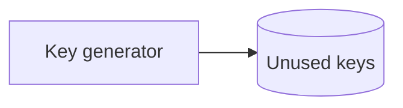
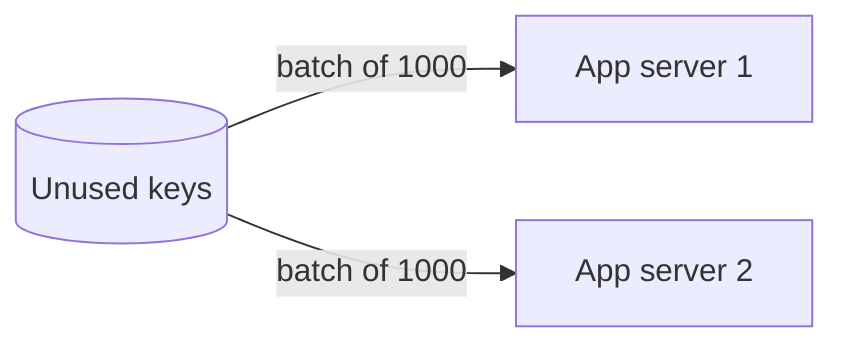
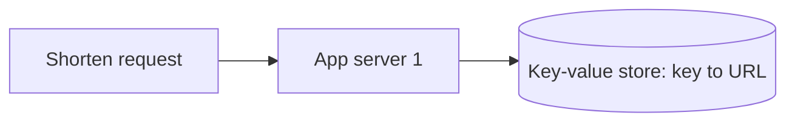
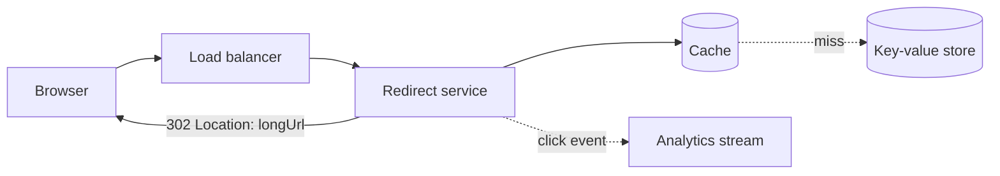

This lesson designs the API, the storage and the most interesting component of a URL shortener: generating unique short keys.

## API

```http
POST   /v1/links        { longUrl, customAlias?, expiresAt? }  -> { key, shortUrl }
GET    /{key}           -> 301 or 302 redirect to longUrl
DELETE /v1/links/{key}
GET    /v1/links/{key}/stats?from=..&to=..
```

**301 or 302?** A `301 Moved Permanently` lets browsers cache the redirect, reducing load on our servers but hiding repeat clicks from analytics. A `302 Found` (or `307`) sends every click through our servers, enabling accurate analytics and allowing the destination to change. Services that sell analytics typically use 302.

## Storage

The data model is a simple mapping:

| Field | Example |
| --- | --- |
| key (primary key) | `aZ3kP9x` |
| long_url | `https://example.com/...` |
| owner_id | user or API key |
| created_at, expires_at | timestamps |

Access is almost entirely by key, with no joins, so a **distributed key-value store** partitioned by key is a natural fit. Consistent hashing spreads keys evenly, and replication across zones provides durability and availability.

## Generating keys

We need 7-character keys that are unique and hard to guess. There are three main approaches.

### Approach 1: hash the long URL

Compute a hash such as MD5 or SHA-256 of the long URL, encode it in base 62 and take the first 7 characters. The same URL always gets the same key, which deduplicates repeated submissions.

The problem is **collisions**: two different URLs can share the first 7 characters. On insert, we must check whether the key exists with a different URL and, if so, rehash with a salt and try again. Each check is a database read before every write, and collision rates rise as the table fills.

### Approach 2: encode a unique counter

Assign each new URL a unique integer from a counter and encode it in base 62. Every number maps to a distinct key, so there are no collisions.

```text
id = 125,000,000,000   ->   base62   ->   "2B2hNhm"
```

A single counter would be a bottleneck and single point of failure, so we use the **sequencer** building block: a range allocator hands out blocks of IDs to application servers.

Plain counters produce predictable, sequential keys. To fix this, apply a **reversible scrambling function** to the ID before encoding, such as a keyed permutation or a small block cipher over the ID space. Keys remain unique but appear random.

### Approach 3: a pre-generated key service

A **key generation service** creates random 7-character keys in advance, stores them in a table of unused keys and hands batches to application servers. When a server uses a key, it is already guaranteed unique.

<Slides title="Key generation service">
<Slide caption="1. Offline, the key service generates random keys and stores those not already used.">



</Slide>
<Slide caption="2. Each application server fetches a batch of keys and keeps them in memory. The batch is marked as used in the key store atomically.">



</Slide>
<Slide caption="3. Shortening a URL pops a key from the local batch: no coordination, no collision check.">



</Slide>
</Slides>

If an application server crashes, the unused keys in its batch are lost. With a key space of 3.5 trillion, that waste is negligible.

### Comparing approaches

| Approach | Collisions | Coordination | Predictability |
| --- | --- | --- | --- |
| Hash of URL | Possible, must check | None | Unpredictable |
| Counter + base 62 | None | Range allocator | Predictable unless scrambled |
| Pre-generated keys | None | Key service hands out batches | Unpredictable |

A counter with scrambling or a pre-generated key service are both strong answers. Custom aliases bypass generation: the service inserts the alias with a conditional write that fails if the key already exists.

## Redirect path



The redirect service looks up the key in the cache, falling back to the store on a miss. It checks expiry, returns the redirect and asynchronously emits a click event for analytics, so analytics never slows down redirects.

<KeyTakeaways>
- A 301 reduces load but hides repeat clicks; a 302 routes every click through the service for analytics.
- A key-value store partitioned by key fits the simple, key-based access pattern.
- Hashing URLs risks collisions that need checks; counters need a range allocator and scrambling to avoid predictable keys.
- A pre-generated key service hands out batches of unique random keys, avoiding collisions and coordination per request.
- The redirect path is cache-first, and click analytics are emitted asynchronously.
</KeyTakeaways>
