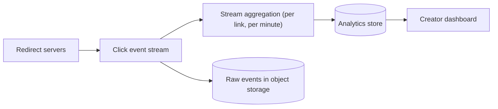

A URL shortener looks simple, but defending it well means discussing availability of redirects, hot keys, expiration, analytics at scale and, above all, abuse.

## Requirements check

| Requirement | How the design meets it |
| --- | --- |
| Available redirects | Stateless redirect servers in several regions; the key-value store is replicated across zones and regions; a large cache absorbs most reads. |
| Low latency | Cache hits take about a millisecond; regional deployment keeps network latency low. |
| Unique, unpredictable keys | Pre-generated random keys or scrambled counter IDs. |
| Durability | Replicated key-value store with backups. |
| Scalability | Key space partitioned with consistent hashing; redirect servers scale horizontally. |

## Hot links

A link shared by a celebrity may receive tens of thousands of clicks per second. Because the mapping never changes, it can be cached everywhere:

- In the **distributed cache**, replicated to several nodes for hot keys so no single cache node saturates.
- In a small **in-process cache** on each redirect server, with a short time-to-live.
- At the **CDN edge**, if the service routes its short domain through a CDN, which can cache redirect responses for a short time while still logging clicks at the edge.

## Expiration and deletion

Expired links should stop redirecting promptly, but scanning 12 billion records for expired ones is wasteful. Two complementary mechanisms work well:

- **Lazy checking:** on every redirect, compare `expires_at` with the current time and return `410 Gone` if expired. This guarantees correctness.
- **Background cleanup:** a low-priority job scans partitions during quiet hours, deletes expired records and optionally returns their keys to the unused pool.

Deletions must also purge the key from caches, or the link keeps working until its cache entry expires. Short cache TTLs bound that window.

## Analytics at scale

Recording every click synchronously would put a database write on the hot path. Instead, redirect servers publish click events to a stream. Stream processors aggregate counts per link per minute, by country and referrer, and write them to an analytics store optimized for time-series queries. Raw events go to cheap object storage for batch reprocessing.

## Abuse and safety

Short links hide their destination, which attackers exploit for phishing and malware. A responsible service:

- **Checks URLs at creation** against safe-browsing and malware lists, and rescans periodically, because a harmless destination can later turn malicious.
- **Rate limits creation** per user, API key and IP address to prevent spam campaigns from minting millions of links.
- **Shows an interstitial warning** for suspicious destinations instead of redirecting directly.
- **Supports reporting and takedown**, removing a key from caches immediately.
- **Blocks redirect loops**, such as short links pointing to other short links of the same service.

## Trade-offs and extensions

- **Deduplication:** returning the same short key for the same long URL saves space but leaks information (anyone can discover that a URL was shortened before) and conflicts with per-user analytics. Most services issue a new key per request.
- **Custom domains** let businesses use their own short domain; the service maps domain plus key to URL.
- **Multi-region writes:** because keys are pre-generated or allocated in ranges per region, each region can create links independently without conflicts.

<Callout type="interview">
Interviewers often ask, "What happens if the key generation service goes down?" A good answer: application servers hold batches of keys in memory, so creation continues for a while; the key service itself is replicated; and redirects do not depend on it at all.
</Callout>

## Latency budget for a redirect

| Step | Cache hit | Cache miss |
| --- | --- | --- |
| Network to the nearest region | 20–60 ms | 20–60 ms |
| Load balancer and redirect server | 1 ms | 1 ms |
| In-process or distributed cache lookup | 0.5 ms | 0.5 ms (miss) |
| Key-value store read | — | 2–5 ms |
| Emit click event (asynchronous) | ~0 on the request path | ~0 |
| **Server-side total** | **~2 ms** | **~7 ms** |

Network distance, not server work, dominates — which is why regional deployment matters more than further server optimization.

<Ponder question="An attacker enumerates random 7-character keys at 50,000 requests per second to discover private links. How does the design limit this?">
The key space is 3.5 trillion and only about 12 billion keys are in use, so a random guess hits a real link about 0.3% of the time — still too often for sensitive links. Rate limiting redirects per IP and per network makes large-scale enumeration slow; monitoring for high miss rates (many 404s from one source) flags and blocks scanners; and links meant to be private should use longer keys or require authentication rather than relying on obscurity.
</Ponder>

<KeyTakeaways>
- Redirects stay available and fast through multi-region stateless servers, a replicated store and layered caches.
- Hot links are handled with replicated cache entries, in-process caches and optional CDN caching.
- Expiration combines lazy checks at redirect time with background cleanup.
- Click analytics flow through a stream and are aggregated asynchronously.
- Abuse prevention includes URL scanning, rate limiting, warnings, takedowns and loop detection.
- Redirect latency is dominated by network distance; the server work is a few milliseconds.
</KeyTakeaways>
