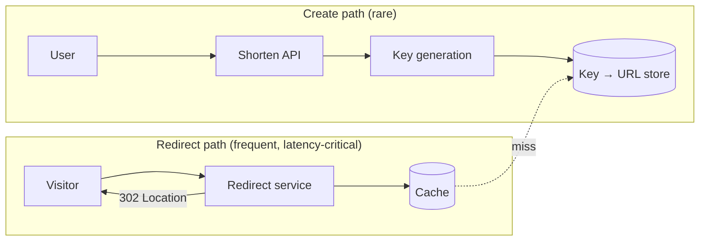

A URL shortener turns a long, unwieldy web address into a short one that is easy to share, type and fit into a message. Services of this kind shorten billions of links: in social media posts, printed on posters and packaging, in SMS messages with character limits, and in marketing campaigns that want to measure clicks.

```text
https://shop.example.com/collections/autumn-2026/boots?color=brown&size=42&utm_source=newsletter
                                      ↓
https://sho.rt/aZ3kP9x
```

When someone opens the short link, the service looks up the original address and redirects the browser to it — usually within a few milliseconds.

## Why it is a classic interview problem

The functionality fits in a sentence, which lets the conversation focus on system design fundamentals rather than product details:

- **Estimation drives decisions.** How many links will exist in five years determines the key length and the storage choice.
- **Key generation is a genuinely interesting problem.** Keys must be short, unique and hard to guess, generated by many servers without collisions.
- **The workload is extremely read-heavy.** Redirects outnumber creations by about 100 to 1, and a few links go viral, so caching strategy matters.
- **Availability requirements are asymmetric.** If link creation is down for a minute, a few users retry. If redirects are down, every link ever shared is broken.
- **Abuse is real.** Short links hide their destinations, which makes them attractive for phishing and spam.

## The two paths



As in the video platform, separating the write path from the read path lets each be designed for its own needs: the create path for correctness (unique keys, safety checks), the redirect path for availability and speed.

## Building blocks involved

| Need | Building block |
| --- | --- |
| Unique keys without coordination on each request | Sequencer or pre-generated key service |
| Billions of small key-to-URL records | Key-value store partitioned by key |
| Fast redirects for popular links | Distributed cache, possibly a CDN |
| Protecting the create API | Rate limiter |
| Click analytics without slowing redirects | Messaging queue or pub-sub stream |

## Chapter roadmap

1. **Requirements and estimation** — features, scale and how long keys must be.
2. **Design** — the API, storage and key generation approaches.
3. **Evaluation** — availability, hot links, expiration, analytics and abuse.

<Callout type="interview">
Because the product is simple, interviewers expect depth. Plan to spend most of your time on key generation (and its trade-offs), the read path's caching, and what happens when components fail.
</Callout>

<Ponder question="Why do most URL shorteners use a 302 (temporary) redirect even though the mapping never changes?">
A 301 (permanent) redirect lets browsers and intermediaries cache the mapping, so repeat visits never reach the service — cheaper, but the service loses click analytics and cannot later disable a link that turns out to be malicious or expired. A 302 keeps every click flowing through the service, enabling analytics, expiration and takedowns. The small extra load is easily absorbed by caching on the server side.
</Ponder>

<KeyTakeaways>
- A URL shortener maps short keys to long URLs and redirects visitors, at a scale of billions of links.
- It is a classic interview problem because estimation, key generation, caching and availability all matter.
- Redirects vastly outnumber creations and must be far more available.
- The design separates a correctness-focused create path from a speed-focused redirect path.
- It reuses the sequencer, key-value store, cache, rate limiter and messaging building blocks.
</KeyTakeaways>
