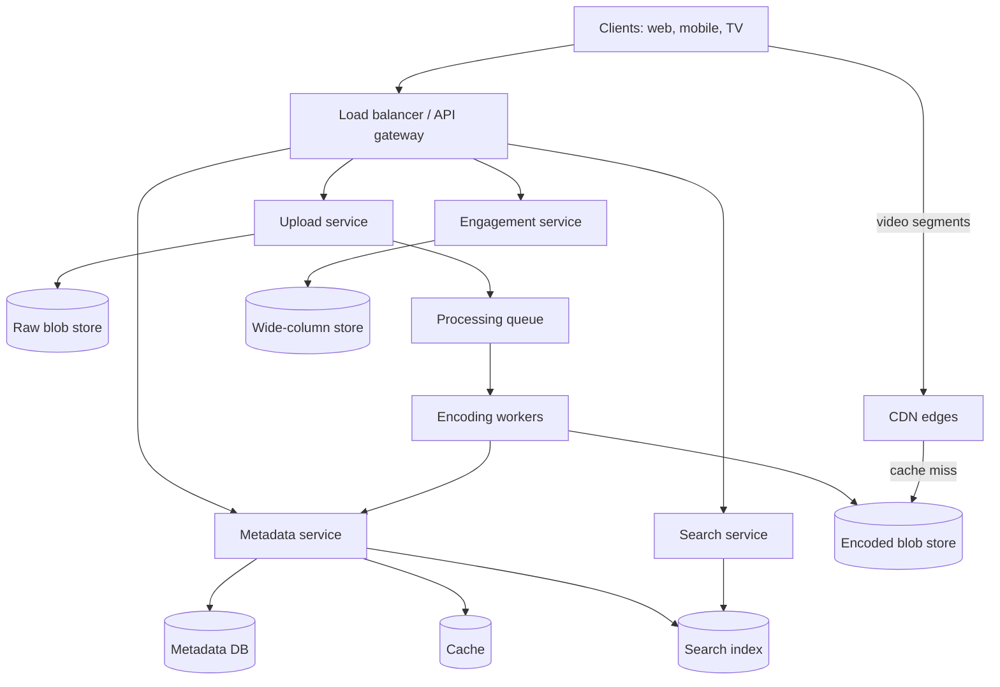
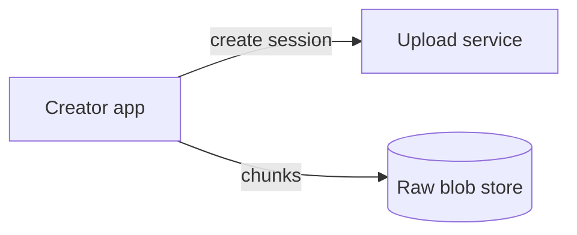
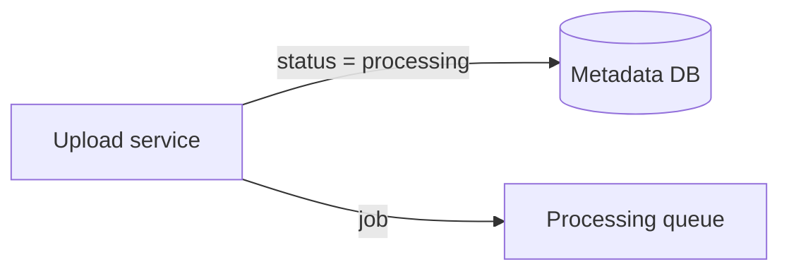
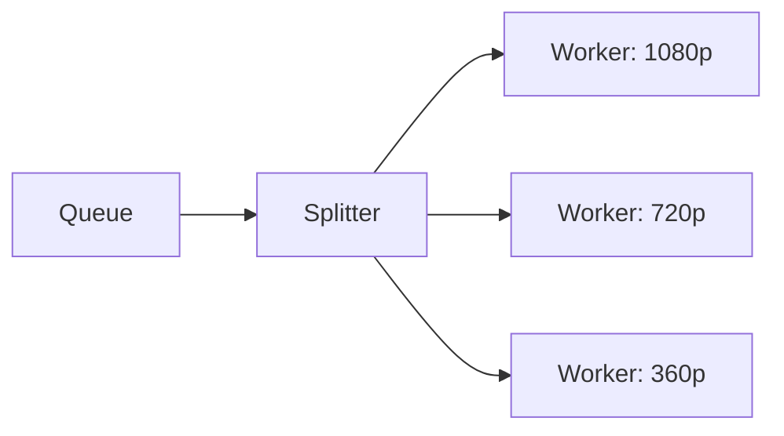
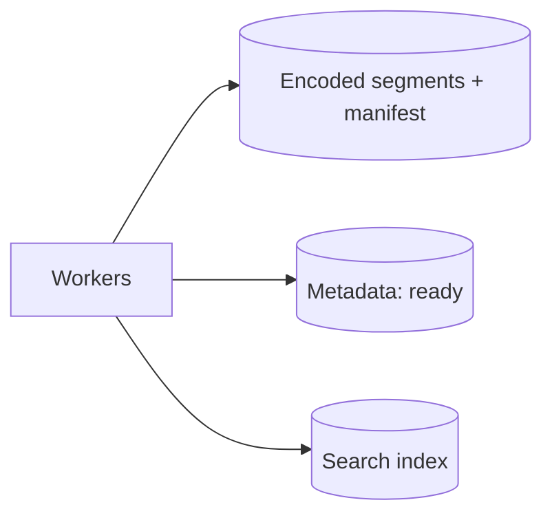
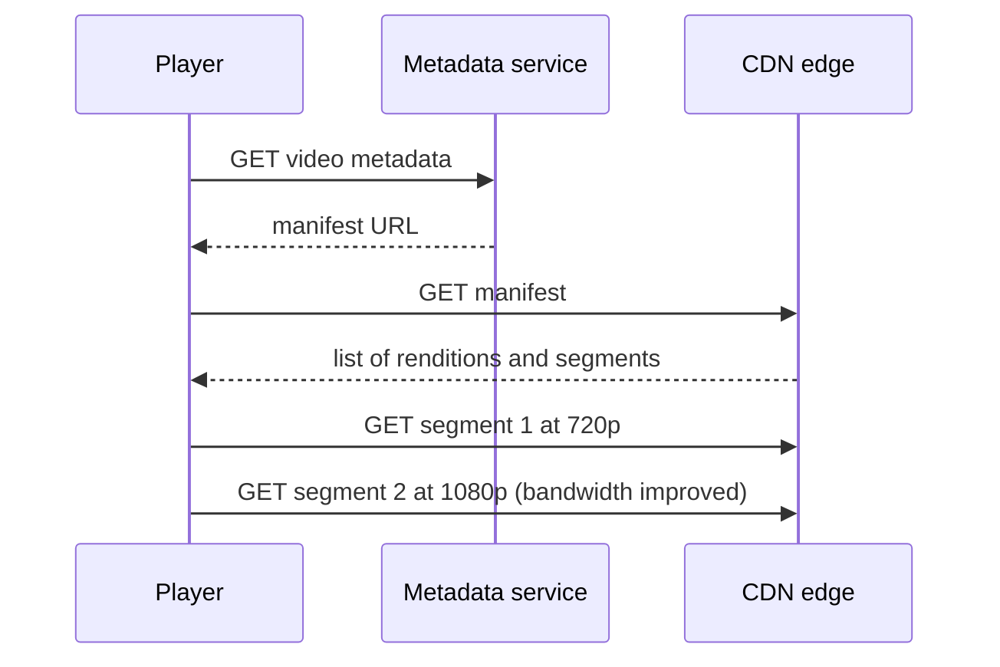

With requirements and estimates settled, we move to the **API**, **data model** and **layout** steps of SCALED. The design keeps the upload path and the watch path separate, and connects them through durable storage and an asynchronous processing pipeline.

## API design

A handful of endpoints cover the core features. Uploads use resumable, chunked transfers, because large files over flaky networks will fail part-way.

```http
POST   /v1/uploads                      -> { uploadId, uploadUrl }
PUT    /v1/uploads/{uploadId}/chunks/{n}  (resumable chunk upload)
POST   /v1/videos                       { uploadId, title, description, tags } -> { videoId }
GET    /v1/videos/{videoId}             -> metadata + manifest URL
GET    /v1/search?q=...&pageToken=...
POST   /v1/videos/{videoId}/likes
POST   /v1/videos/{videoId}/comments    { text }
GET    /v1/channels/{channelId}/videos?pageToken=...
```

The upload URL is often a **pre-signed URL** that lets the client write directly to the blob store, so gigabytes of video never pass through the application servers.

## Data model

| Store | Data | Why this store |
| --- | --- | --- |
| Relational database (sharded by user or video ID) | Users, channels, video metadata, processing status | Structured data with relationships and modest volume |
| Wide-column store | Comments, likes, view events | High write volume, simple access patterns |
| Blob store | Raw uploads, encoded segments, thumbnails | Petabytes of immutable binary objects |
| Search index | Titles, descriptions, tags | Full-text search with ranking |
| Cache | Hot video metadata, counts, manifests | Absorbs read-heavy traffic |

A video's metadata row holds its ID, owner, title, description, status (`uploading`, `processing`, `ready`, `failed`), duration and pointers to its thumbnails and manifest.

## High-level architecture



## The upload and processing pipeline

<Slides title="From upload to published video">
<Slide caption="1. The client requests an upload session and sends chunks directly to the raw blob store using a pre-signed URL. Failed chunks are retried individually.">



</Slide>
<Slide caption="2. When all chunks arrive, the upload service marks the video as processing and enqueues a job.">



</Slide>
<Slide caption="3. A coordinator splits the video into short chunks so many workers encode it in parallel into every resolution and codec on the ladder.">



</Slide>
<Slide caption="4. Workers write segments and a streaming manifest, generate thumbnails, then mark the video ready and index it for search.">



</Slide>
</Slides>

Parallel encoding matters: a two-hour film encoded serially could take hours, but split into thousands of short chunks it can finish in minutes. The pipeline is a directed graph of tasks, so the task scheduler from Part II fits well, with retries for failed chunks.

## Streaming with adaptive bitrate

Each rendition is cut into segments of a few seconds and described by a **manifest** (HLS or DASH). The player downloads the manifest, measures its throughput and picks the best rendition it can sustain, switching up or down at segment boundaries. This is **adaptive bitrate streaming**, and it is why playback rarely stalls even when the network changes.



Because segments are small, immutable files with stable URLs, CDNs cache them extremely well.

## Search and engagement

The metadata service publishes changes to the search index asynchronously, so search is eventually consistent. Likes and views are high-volume writes; they go to the wide-column store through a queue, and counts are aggregated with sharded counters and cached.

<KeyTakeaways>
- Uploads are resumable, chunked and written directly to the blob store through pre-signed URLs.
- Metadata lives in a sharded relational database, engagement data in a wide-column store, and video bytes in a blob store.
- An asynchronous, queue-driven pipeline splits videos into chunks and encodes them in parallel into a ladder of renditions.
- Adaptive bitrate streaming serves small, immutable segments described by a manifest, which CDNs cache efficiently.
- Search indexing and engagement counts are updated asynchronously and are eventually consistent.
</KeyTakeaways>
