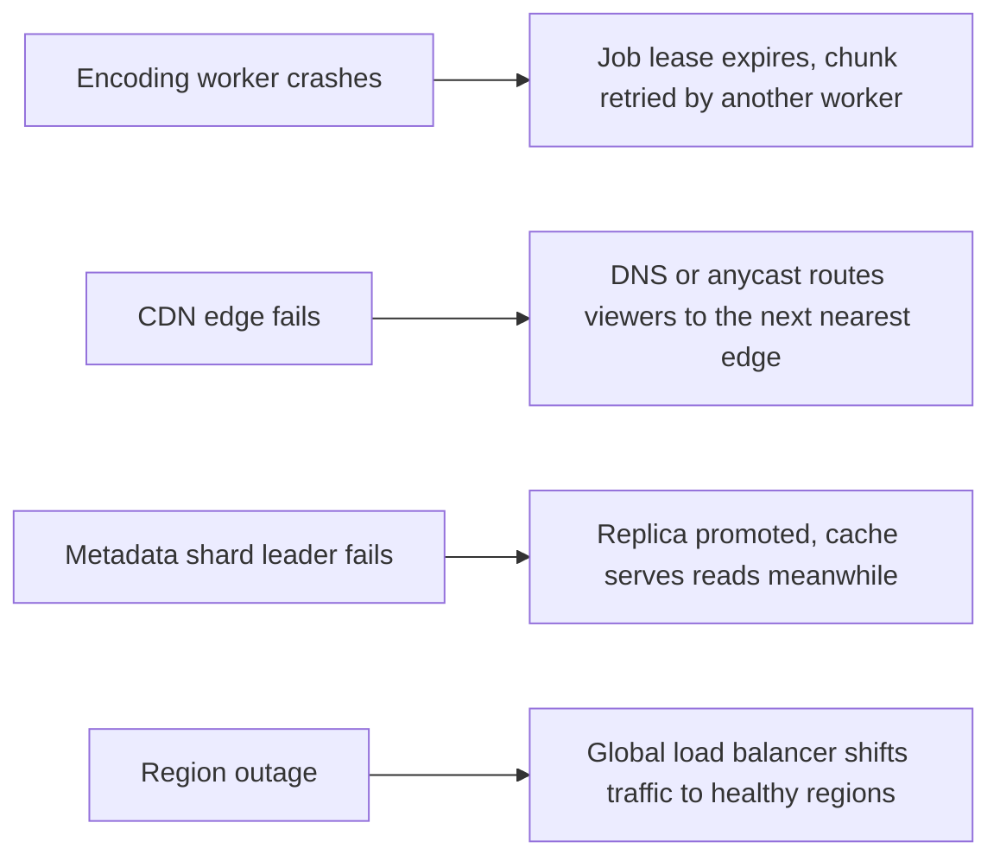

The **Defend** step of SCALED checks the design against its non-functional requirements and makes its trade-offs explicit. A good evaluation also names what would break first under growth, and how we would respond.

## Meeting the requirements

| Requirement | How the design meets it |
| --- | --- |
| Availability of playback | Segments are served from many CDN edges; metadata is replicated across regions and cached. A regional failure shifts traffic to other regions. |
| Low start-up latency | The manifest and first segments come from a nearby edge; small first segments and a low initial bitrate let playback start quickly. |
| No rebuffering | Adaptive bitrate lets the player drop to a lower rendition before its buffer runs dry. |
| Durability | Raw and encoded files are replicated or erasure-coded across failure domains in the blob store, and the upload is acknowledged only after it is durably stored. |
| Scalability | Stateless services scale horizontally; the encoding fleet scales with queue depth; metadata is sharded; storage is a scalable blob store. |

## Trade-offs we made

**Eventual consistency for engagement and search.** A like might take a few seconds to appear in the count, and a new video a minute to appear in search. In exchange, writes are cheap and reads are served from caches. For a video platform this is clearly the right trade.

**Storage for bandwidth.** Storing many renditions multiplies storage, but lets each viewer download only the bytes their screen and network can use. Since bandwidth costs far more than storage over a video's life, the trade pays off, especially for popular videos.

**Latency of publishing for throughput.** Encoding is asynchronous, so creators wait minutes before their video is ready. Some platforms publish a low-resolution rendition first and add higher ones as they finish, shrinking the perceived wait.

## Handling popularity skew

Views follow a power law. The design handles this at several layers:

- **Hot videos** stay in CDN edge caches and are effectively free for the origin.
- **The long tail** of rarely watched videos causes cache misses. A tiered CDN, with regional mid-tier caches between edges and the origin, collapses many misses into one origin fetch.
- **Viral spikes** can be absorbed by proactively pushing a video's segments to edges when its view rate climbs quickly, and by **request coalescing** at the edge, so a thousand simultaneous misses for the same segment become one upstream request.
- **Hot metadata**, such as the watch page for a viral video, is cached in memory with short time-to-live values and replicated to avoid a single hot cache node.

## Failure scenarios

Because every stage of the pipeline is idempotent and driven by durable queues, a crash only delays a video; it never corrupts or loses it.

## What would break first

At ten times the traffic, the first pressure points would be egress capacity at the CDN and the metadata cache for the most popular videos. At ten times the uploads, the encoding fleet and blob storage growth would dominate cost. Being able to name these shows the interviewer you understand where the real limits are.

<Callout type="interview">
When defending a design, pair each trade-off with the reason it fits this product: “We accept stale like counts because nobody makes a decision based on the exact number, and it lets us serve counts from a cache.”
</Callout>

<KeyTakeaways>
- Playback availability comes from CDN edges, replicated metadata and multi-region failover.
- Adaptive bitrate and small first segments keep start-up latency low and prevent rebuffering.
- The design trades storage for bandwidth, publishing latency for throughput and consistency for cheap reads.
- Tiered caching, proactive pushing and request coalescing tame both the long tail and viral spikes.
- Idempotent, queue-driven processing means failures delay work but never lose it.
</KeyTakeaways>
