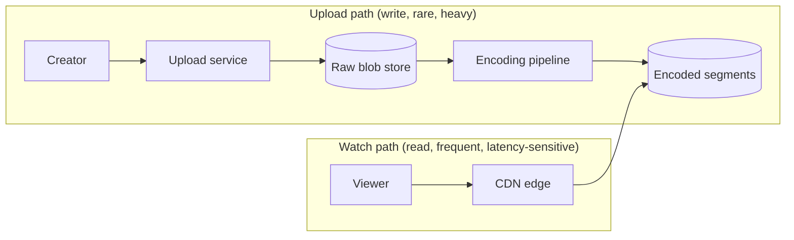

A video platform lets anyone upload a video and lets billions of people watch it on any device, over any network, within a second or two of pressing play. It is one of the most popular interview problems because it touches almost every building block from Part II: blob storage for the raw and encoded files, a CDN for delivery, databases and caches for metadata, message queues for the processing pipeline, and search for discovery.

## Why this problem is hard

At first glance a video platform is a file server with a web page in front of it. The difficulty comes from scale and from the nature of video itself:

- **Size.** A single minute of high-quality source footage can be hundreds of megabytes. Hundreds of hours of video are uploaded every minute on the largest platforms.
- **Heterogeneous clients.** The same video must play on a 4K television on fiber, a laptop on hotel Wi-Fi and a budget phone on a congested mobile network. One file cannot serve them all.
- **Read-heavy, skewed traffic.** Views outnumber uploads by orders of magnitude, and a small fraction of videos receives most of the views. A video can also go viral within minutes.
- **Bandwidth cost.** Egress bandwidth, not compute, dominates the bill. Every design decision about encoding and caching is ultimately a decision about bytes shipped.

## The core flows

The design revolves around two flows that behave very differently:

The **upload path** is rare but expensive: a creator sends a large file that must be stored durably, checked, transcoded into many formats and published. It can take minutes, and that is acceptable. The **watch path** is frequent and latency-sensitive: a viewer expects playback to start almost immediately and never stall. The watch path must be served from caches close to the viewer, never from the origin if it can be helped.

Separating these two paths is the first key insight. They have different scaling characteristics, different consistency needs and different failure tolerance, so they get different infrastructure.

## What we will design

Following SCALED, this chapter covers:

1. **Requirements:** which features are in scope, and estimates for storage, bandwidth and servers.
2. **Design:** the API, the data model and the high-level architecture for upload, processing, streaming and search.
3. **Evaluation:** how the design meets its non-functional requirements and where its trade-offs lie.
4. **Real-world complexity:** what production platforms add, from per-title encoding to their own CDNs.
5. **Exercise:** adapting the design to a short-video app with an endless, recommendation-driven feed.

<Callout type="interview">
Interviewers rarely want every feature. Scope aggressively in the first minutes: “I'll focus on upload, playback and search, and treat comments, recommendations and monetization as out of scope unless we have time.”
</Callout>

## A day in the life of one video

Following one video end to end shows how many building blocks are involved:

| Time | Event | Building blocks involved |
| --- | --- | --- |
| 10:00 | A creator uploads a 12-minute, 2 GB video from a phone | Load balancer, upload service, blob store (resumable chunks) |
| 10:01 | The upload completes; an encoding job is queued | Messaging queue, task scheduler |
| 10:01–10:06 | Workers transcode the video into 8 renditions in parallel and generate thumbnails | Worker fleet, blob store |
| 10:06 | The video is marked ready and indexed for search | Metadata database, search index |
| 10:07 | Subscribers get notified | Pub-sub, notification service |
| 10:10 | 50,000 people start watching; segments are served from nearby edges | CDN, cache |
| All day | Views, likes and comments pour in | Wide-column store, sharded counters |

<Ponder question="Why is it acceptable for the upload path to take minutes when the watch path must start in under two seconds?">
Uploads are rare, and creators understand that processing takes time; a progress indicator and a notification when the video is ready are enough. Viewers, by contrast, are numerous and impatient — each second of start-up delay measurably increases abandonment. The asymmetry lets the design spend time on the upload path (thorough encoding, checks) to make the watch path cheap and fast.
</Ponder>

<KeyTakeaways>
- A video platform exercises nearly every building block: blob store, CDN, database, cache, queue and search.
- Video is large, clients are heterogeneous, traffic is read-heavy and skewed, and bandwidth dominates cost.
- The upload path and the watch path have very different characteristics and should be designed separately.
- Scoping the problem early is essential because the full product is far too big for one interview.
- A single upload touches most building blocks, from the blob store and queues to the CDN and sharded counters.
</KeyTakeaways>
