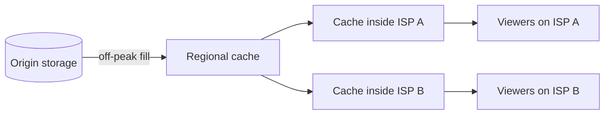

The design in this chapter would work, and it captures the essential architecture. Production video platforms, however, have spent years optimizing every layer, because at their scale a one-percent saving in bandwidth or storage is worth a fortune. This lesson surveys what they add, so you can mention the right refinements when an interviewer pushes deeper.

## Smarter encoding

**Per-title and per-scene encoding.** A fixed bitrate ladder wastes bits on simple content, such as a slideshow or cartoon, and starves complex content, such as sports or confetti. Modern pipelines analyze each video, or even each scene, and choose bitrates that hit a target visual quality. Simple videos get smaller files at the same perceived quality.

**Multiple codecs.** Newer codecs such as VP9, HEVC and AV1 compress far better than H.264, but they cost much more CPU to encode and are not supported by every device. Platforms often encode every upload in H.264 for compatibility, and add AV1 or VP9 only for videos that become popular, where the bandwidth saving justifies the encoding cost.

**Popularity-aware processing.** Most uploads get few views. It is wasteful to spend the full encoding budget on all of them. A common policy is a fast, cheap encode at upload time, followed by a premium re-encode once a video crosses a view threshold.

**Custom hardware.** At the largest scale, platforms build dedicated video transcoding chips, because general-purpose CPUs are too expensive per encoded minute.

## Owning the delivery network

Commercial CDNs are excellent, but the biggest platforms build their own. They place cache appliances **inside internet service providers' networks**, so popular content is served from within the viewer's ISP and never crosses the public internet. The ISP saves on transit costs, the platform saves on bandwidth, and viewers get lower latency. Content is often **pre-positioned** overnight, during off-peak hours, based on predicted demand.

## Everything we left out of scope

- **Recommendations** drive most watch time on modern platforms. They require a separate system: candidate generation from embeddings and viewing history, ranking models, and a feature store fed by event streams.
- **Content moderation and copyright.** Uploads pass through automated classifiers and fingerprinting systems that compare audio and video against reference files from rights holders, before or shortly after publishing.
- **Live streaming** replaces the offline pipeline with real-time ingest and encoding, and trades some latency for scale using the same segment-based delivery.
- **Advertising** inserts ads into the stream, either on the client or by stitching them into the manifest on the server, and needs its own auction and measurement systems.
- **Analytics.** View events feed real-time dashboards for creators and batch pipelines for billing and recommendations.

## Measuring quality of experience

Production platforms obsess over **quality of experience** metrics: time to first frame, rebuffering ratio, average delivered bitrate and playback failures. These metrics are collected from players, broken down by device, ISP and region, and used to tune encoding ladders, CDN routing and player logic. Experiments with new codecs or buffer strategies are rolled out as A/B tests measured against these metrics.

<Callout type="tip">
You do not need to cover all of this in an interview. Mentioning one or two refinements, such as per-title encoding or ISP-embedded caches, with a sentence on why they matter at scale, signals real depth.
</Callout>

<KeyTakeaways>
- Per-title and per-scene encoding choose bitrates by content complexity, saving bandwidth at equal quality.
- Expensive modern codecs are applied selectively to popular videos, where the bandwidth savings pay off.
- The largest platforms run their own CDNs with caches embedded inside ISP networks and pre-position content off-peak.
- Recommendations, moderation, live streaming, ads and analytics are major systems in their own right.
- Quality-of-experience metrics from players drive continuous tuning of encoding and delivery.
</KeyTakeaways>
