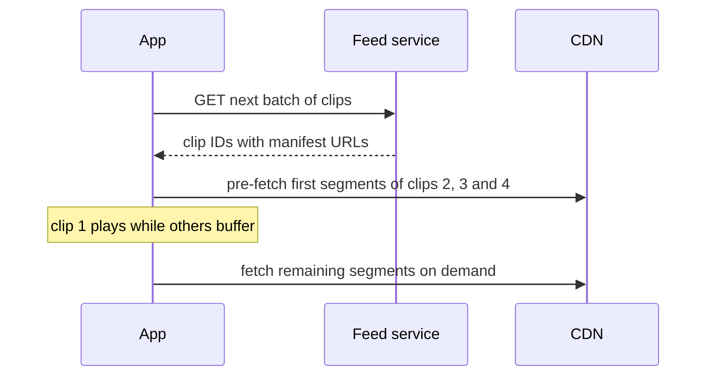

A short-video app shows an endless vertical feed of clips, each lasting seconds rather than minutes. Swipe up and the next clip plays instantly. The building blocks look similar to a traditional video platform, but the product changes which parts are hard. Try the exercise yourself before reading the discussion below.

## The prompt

Design a short-video app where users record and upload clips of up to 60 seconds, and viewers scroll a personalized feed in which each clip starts playing the moment it appears.

Spend 20 to 30 minutes on SCALED, then compare your answer with the notes that follow.

## What changes compared with a long-form platform

| Aspect | Long-form platform | Short-video app |
| --- | --- | --- |
| Discovery | Search and subscriptions matter a lot | The recommendation feed is the product |
| Session pattern | A few long views | Dozens or hundreds of short views per session |
| Start-up latency | Two seconds is acceptable | Playback must feel instant on every swipe |
| Upload volume | Fewer, larger files | Many more, smaller files |
| Engagement signals | Watch time, likes | Completion rate, re-watches, skips within a second |

## Discussion: key design decisions

**Pre-fetching is essential.** The client cannot wait for a manifest and segments after each swipe. Instead, the feed API returns a batch of clip IDs, and the player pre-fetches the first second or two of the next several clips in the background. When the viewer swipes, the next clip is already buffered. Pre-fetching wastes some bandwidth on clips that are skipped, so the client limits how many it pre-loads based on network conditions.

**Short clips simplify encoding.** A 30-second clip does not need to be split for parallel encoding; one worker can encode it quickly. With so many uploads, though, the encoding fleet must still be elastic and queue-driven. Publishing speed matters to creators, so the pipeline aims to make clips available within seconds.

**The recommendation system is the core.** The feed is generated by a ranking pipeline: candidate generation pulls a few thousand clips from many sources (followed creators, trending content, clips similar to recently liked ones), and a ranking model scores them using features such as predicted completion rate. Freshness matters, because trends move within hours.

**Real-time feedback loops.** Engagement signals from each swipe, such as watched to completion or skipped after half a second, stream into the feature store within seconds so the next batch of recommendations reflects the viewer's current mood. This pushes the design towards a streaming pipeline with a messaging queue and stream processors.

**Caching is different.** Because the feed is personalized, the feed response cannot be shared between users. The clips themselves, however, are very cacheable, and a trending clip may be watched hundreds of millions of times in a day.

<Callout type="interview">
In a short-video variant, spend your deep-dive time on the feed: pre-fetching, recommendation freshness and the real-time signal pipeline. Those are what distinguish it from the long-form design.
</Callout>

<KeyTakeaways>
- Short-video apps reuse the upload, encoding and CDN design but make the recommendation feed the core of the product.
- Instant playback requires the client to pre-fetch the start of upcoming clips, balanced against wasted bandwidth.
- Short clips can be encoded by a single worker, but upload volume still requires an elastic, queue-driven fleet.
- Engagement signals must flow into recommendations within seconds, which calls for a streaming pipeline.
- Personalized feeds cannot be shared from a cache, but the clips themselves are highly cacheable.
</KeyTakeaways>
