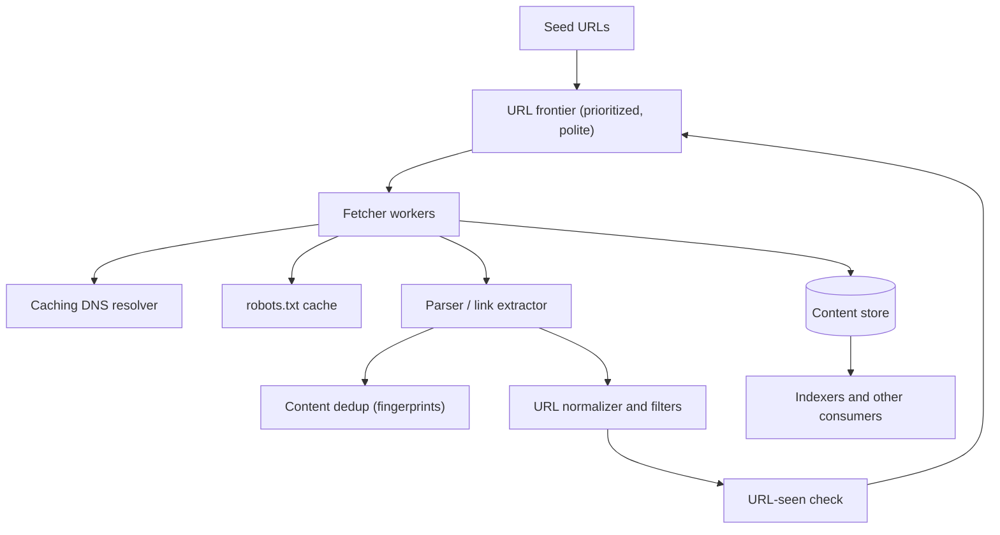
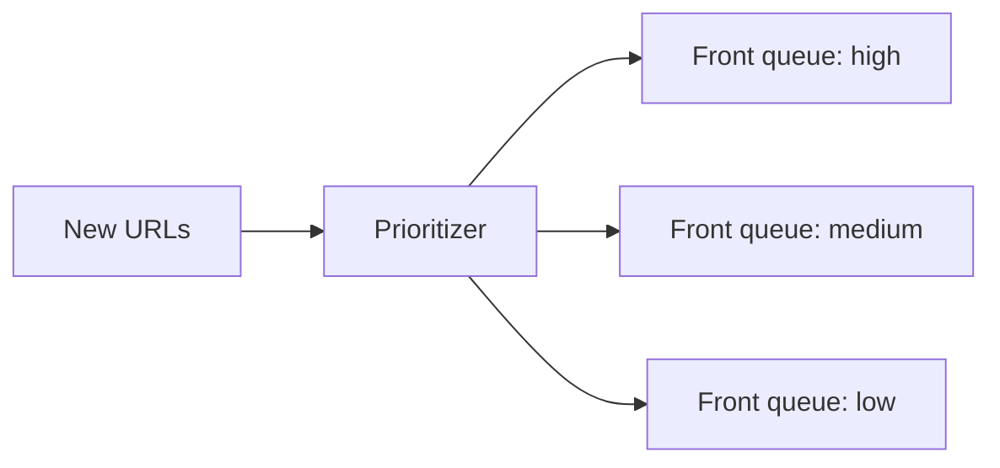
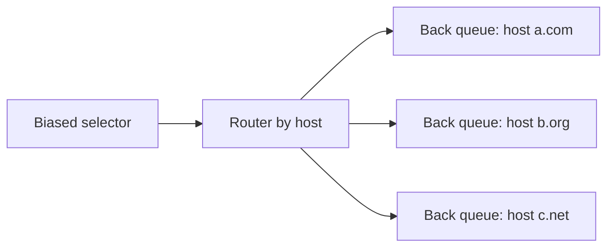
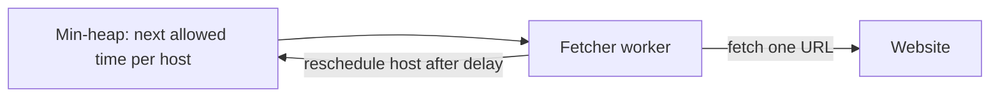
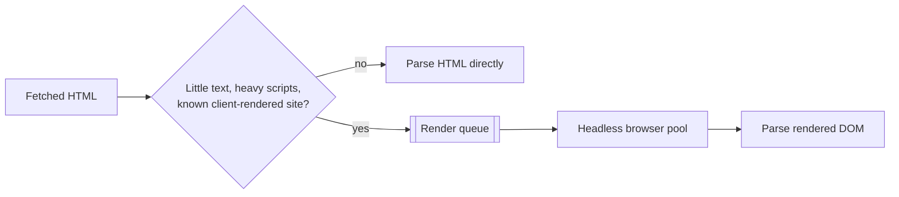

This lesson presents the components of a scalable crawler and how they work together. The design centers on the **URL frontier**, which decides what to crawl next while keeping the crawler polite.

## Components



- **URL frontier:** stores URLs to crawl, orders them by priority and enforces per-host politeness.
- **Fetcher workers:** download pages over HTTP with asynchronous I/O, respecting timeouts and size limits.
- **Caching DNS resolver:** resolves hostnames quickly, caching results.
- **robots.txt cache:** stores each host's crawling rules, refreshed periodically.
- **Parser:** extracts links and text from HTML.
- **Content deduplication:** detects pages whose content has already been seen.
- **URL normalizer and filters:** canonicalizes URLs and drops unwanted ones.
- **URL-seen check:** skips URLs already in the frontier or crawled recently.
- **Content store:** keeps compressed page content and metadata in a blob store or wide-column store.

## The URL frontier

The frontier must satisfy two goals at once: crawl important pages first (**priority**) and never hit one host too hard (**politeness**). A common design uses two layers of queues.

<Slides title="Inside the URL frontier">
<Slide caption="1. Front queues handle priority. A prioritizer assigns each URL a priority, and higher-priority queues are selected more often.">



</Slide>
<Slide caption="2. Back queues handle politeness. Each back queue holds URLs for a single host, so fetches for a host are serialized.">



</Slide>
<Slide caption="3. A heap tracks when each host may next be contacted. Fetchers take the host whose time has arrived, fetch one URL and reschedule the host after a delay.">



</Slide>
</Slides>

**Priority** can come from signals such as the page's link-based importance, its site's quality, how often it changes and whether it has ever been crawled. **Politeness** delays are based on the host's `Crawl-delay` directive if present, or on a multiple of the host's recent response time, so slow servers get fewer requests.

At billions of URLs, the frontier does not fit in memory. It is kept mostly on disk in a partitioned store, with in-memory buffers for the head of each queue. The frontier is partitioned **by host** across crawler nodes, so each host is managed by exactly one node, which makes per-host politeness a local decision.

## Fetching

Fetchers use asynchronous HTTP clients with:

- **Timeouts** for connection and total download time, so slow servers do not tie up resources.
- **Size limits**, truncating or skipping pages that are unusually large.
- **Redirect limits** to avoid loops.
- **Conditional requests** (`If-Modified-Since` or `ETag`) when recrawling, so unchanged pages cost almost nothing.
- **Compression** support to reduce bandwidth.

## Parsing and URL handling

The parser extracts links, resolves relative URLs and normalizes them: lowercasing the scheme and host, removing default ports and fragments, sorting or stripping known tracking parameters. Filters drop URLs for disallowed file types, blocked domains and paths disallowed by `robots.txt`.

The **URL-seen check** must answer "have we seen this URL?" for billions of URLs. A **Bloom filter** provides a compact, fast first check with occasional false positives (a new URL is wrongly considered seen and skipped, which is acceptable), backed by a partitioned store of URL fingerprints for exact answers when needed.

## Storage

Pages are compressed and stored in a blob store or wide-column store, keyed by URL fingerprint and fetch time. Metadata such as status, content fingerprint, last-modified time and outgoing links is stored alongside, and change events are published for downstream consumers like the indexer.

## Sizing the Bloom filter

A Bloom filter with `m` bits and `k` hash functions holding `n` items has a false-positive rate of about `(1 − e^(−kn/m))^k`. With about **10 bits per URL** and **7 hash functions**, the false-positive rate is roughly **1%**.

```text
n = 10 billion URLs × 10 bits = 100 billion bits ≈ 12.5 GB
Partitioned by host across 50 frontier nodes → 250 MB per node
```

A 1% false-positive rate means 1% of genuinely new URLs are wrongly skipped. For a search crawler that is acceptable — important pages are usually linked from many places and will be discovered again — and the memory saving over an exact set of 10 billion URLs (hundreds of gigabytes) is enormous.

## Rendering JavaScript-heavy pages

Some pages contain little content until JavaScript runs. Rendering them requires a headless browser, which costs one to two orders of magnitude more CPU and memory than parsing HTML. A crawler therefore renders **selectively**:



The render queue is separate and rate-limited, so expensive rendering never slows the main crawl, and results are cached per site template where possible.

<Ponder question="Why partition the frontier by host rather than by URL hash?">
Politeness is a per-host rule: at most one connection and a delay between requests to each host. If a host's URLs were spread across many nodes by URL hash, every node would need to coordinate with the others before contacting that host. Partitioning by host puts all of a host's URLs and its scheduling state on one node, so politeness is enforced locally with no coordination.
</Ponder>

<KeyTakeaways>
- The crawler consists of a frontier, fetchers, DNS and robots caches, a parser, deduplication, URL filtering and a content store.
- The frontier uses front queues for priority and per-host back queues with a scheduling heap for politeness.
- Partitioning the frontier by host makes politeness a local decision on each node.
- Fetchers use asynchronous I/O with timeouts, size and redirect limits, and conditional requests for recrawls.
- URLs are normalized and checked against a Bloom filter backed by a fingerprint store.
- A Bloom filter with about 10 bits per URL gives roughly 1% false positives at a fraction of an exact set's memory.
- JavaScript rendering is expensive, so it runs selectively in a separate, rate-limited queue.
</KeyTakeaways>
