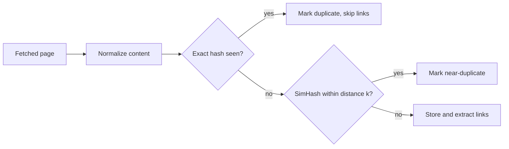

A crawler that works on a handful of friendly websites can fail badly on the open web. This lesson evaluates the design against three hard realities: sites must not be overloaded, the web is full of duplicate content, and some URL spaces are effectively infinite.

## Politeness

An aggressive crawler can look like a denial-of-service attack to a small website. Politeness is both an ethical obligation and a practical one: impolite crawlers get blocked.

- **robots.txt.** Before crawling a host, fetch its `robots.txt`, cache it for about a day and obey its `Disallow` rules and any crawl-delay. If `robots.txt` is unreachable because of a server error, a conservative crawler pauses crawling that host rather than assuming everything is allowed.
- **One connection per host at a time**, with a delay between requests, enforced by the per-host back queues and scheduling heap.
- **Adaptive rate.** If a host's response times rise or it returns `429 Too Many Requests` or `503 Service Unavailable`, back off exponentially.
- **Identification.** Use a descriptive User-Agent with a contact URL so site owners can reach the operator.
- **Shared hosting awareness.** Many small sites share one IP address. Rate limits can be applied per IP as well as per hostname, to avoid overwhelming a shared server.

## Deduplication

Studies of the web have found that a large share of pages are exact or near duplicates: mirrors, printer-friendly versions, session IDs in URLs and syndicated articles. Crawling and storing them wastes resources and pollutes search results.

**URL-level deduplication** relies on normalization, stripping session parameters and fragments, and on sites' canonical link declarations (`rel="canonical"`).

**Exact content deduplication** computes a hash, such as SHA-256, of the normalized page content. If the hash was seen before, the page is recorded as a duplicate of the earlier URL and its links are not re-extracted.

**Near-duplicate detection** catches pages that differ only in ads, timestamps or navigation. Techniques such as **SimHash** produce fingerprints where similar documents differ in only a few bits. Pages whose fingerprints are within a small Hamming distance are treated as near duplicates.

## Crawler traps

A **crawler trap** is a URL space that generates an unbounded number of pages, intentionally or accidentally:

- **Calendars** with a "next month" link, forever.
- **Infinitely deep paths**, such as `/a/b/a/b/a/b/...` caused by relative-link bugs.
- **Session IDs or tracking parameters** that make each visit's URLs unique.
- **Faceted navigation** on shopping sites, where combinations of filters and sort orders create millions of URLs for the same products.
- **Soft 404s**: pages that return `200 OK` with "not found" content for any URL.

Defenses include:

- **URL length and depth limits.**
- **Per-host page budgets**, proportional to the site's importance, so a single site cannot consume the crawl.
- **Pattern detection**: repeated path segments or many URLs differing only in parameters trigger rules that collapse or block them.
- **Content deduplication**, which catches traps that serve the same content under many URLs.
- **Soft-404 detection** by requesting a random nonexistent URL on the host and comparing the response.

## Freshness and recrawl scheduling

Pages change at very different rates. A news homepage changes minutes apart; an archived article may never change. The crawler estimates each page's change rate from past crawls and recrawls important, fast-changing pages more often. Conditional requests make checking unchanged pages cheap.

## Fault tolerance

Frontier partitions are replicated and checkpointed, so a failed node's hosts can be reassigned and resumed. Fetchers are stateless and simply take work from the frontier. Because crawling is inherently repeatable, the occasional duplicate fetch after a failure is harmless.

<KeyTakeaways>
- Politeness means obeying robots.txt, one connection per host, adaptive backoff, clear identification and per-IP limits.
- Deduplication happens at the URL level, with exact content hashes and with near-duplicate fingerprints such as SimHash.
- Crawler traps generate infinite URL spaces; limits, per-host budgets, pattern rules and soft-404 checks contain them.
- Recrawl scheduling adapts to each page's change rate and importance.
- Replicated frontier partitions and stateless fetchers make the crawler resilient to failures.
</KeyTakeaways>
