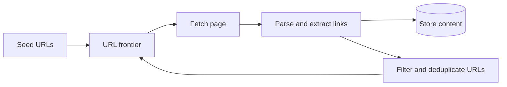

A web crawler systematically downloads web pages, extracts the links they contain and follows those links to discover more pages. Search engines use crawlers to build their indexes; other uses include web archiving, price monitoring, research datasets and training data collection. A crawler that covers a meaningful fraction of the web must fetch billions of pages while being polite to the sites it visits and robust to everything the web throws at it.

## How crawling works

The crawler starts from **seed URLs**, fetches them, extracts links and adds new URLs to the **frontier**, the queue of URLs to crawl. The loop continues indefinitely, with previously crawled pages revisited periodically to pick up changes.

## Functional requirements

- **Crawl:** fetch pages starting from seeds and follow discovered links.
- **Store:** save fetched content and metadata (URL, fetch time, status, headers) for downstream consumers such as indexers.
- **Extract:** parse HTML to find links and normalize them.
- **Recrawl:** revisit pages on a schedule based on how often they change and how important they are.
- **Respect rules:** obey `robots.txt` directives and crawl-rate limits for each site.

Scope decisions to clarify with the interviewer:

- **Content types:** HTML only, or also PDFs, images and other media? We focus on HTML.
- **JavaScript rendering:** many modern pages build their content with JavaScript. Rendering requires a headless browser and is far more expensive. We treat it as an optional, selective stage.

## Non-functional requirements

- **Scalability:** crawl billions of pages per month using many machines in parallel.
- **Politeness:** never overload a website; limit concurrent connections and request rates per host.
- **Robustness:** survive malformed HTML, unresponsive servers, huge pages, redirect loops and crawler traps.
- **Extensibility:** add new content types or processing steps without redesigning the core.
- **Freshness:** important pages that change often should be recrawled often.

## Capacity estimation

| Assumption | Value |
| --- | --- |
| Pages to crawl per month | 15 billion |
| Average page size (HTML) | 100 KB |
| Metadata per page | 500 bytes |
| Retention of content | several versions for important pages |

**Throughput:** 15 billion ÷ (30 × 86,400 seconds) ≈ 5,800 pages per second on average. Plan for peaks of about 10,000 per second.

**Bandwidth:** 5,800 × 100 KB ≈ 580 MB per second, or roughly 4.6 Gbps of inbound traffic.

**Storage:** 15 billion × 100 KB = 1.5 PB per month of raw HTML. Compression typically reduces HTML by a factor of 5 or more, to about 300 TB per month.

**Servers:** a fetch takes on average perhaps 500 ms, mostly waiting on the network, so fetching is I/O-bound and asynchronous. A single worker machine using asynchronous I/O can keep hundreds to thousands of fetches in flight. If each machine sustains 100 pages per second including parsing, 10,000 pages per second needs about 100 crawler machines, plus machines for the frontier, DNS resolution and storage.

<Callout type="note">
DNS lookups become a bottleneck at this scale. A crawler resolves millions of hostnames, and standard resolvers are slow and often synchronous. Crawlers run their own caching DNS resolvers.
</Callout>

## The frontier's size

If the crawler knows about 100 billion URLs (discovered links far outnumber crawled pages) and stores about 100 bytes per URL in the frontier — the URL, a priority and scheduling data — the frontier holds about **10 TB**. It cannot live in memory; it lives on disk, partitioned across nodes, with in-memory buffers for the URLs about to be fetched.

<Ponder question="Why is fetching I/O-bound rather than CPU-bound, and what does that imply for how workers are built?">
Most of a fetch's 500 ms is spent waiting — for DNS, TCP and TLS handshakes, and the remote server — while parsing 100 KB of HTML takes only milliseconds of CPU. A thread per fetch would waste memory on thousands of mostly idle threads, so workers use asynchronous I/O (an event loop) to keep hundreds or thousands of fetches in flight per machine, with a small pool of threads for parsing.
</Ponder>

<KeyTakeaways>
- A crawler loops: take a URL from the frontier, fetch, parse, store content and add new links to the frontier.
- Functional scope includes crawling, storing, link extraction, recrawling and obeying robots.txt.
- Politeness, robustness and scalability are the defining non-functional requirements.
- 15 billion pages per month means about 5,800 pages per second, around 4.6 Gbps and hundreds of terabytes of compressed HTML per month.
- Fetching is I/O-bound, so asynchronous workers and a caching DNS resolver are essential.
- The frontier of known-but-uncrawled URLs is terabytes in size and lives on disk, partitioned by host.
</KeyTakeaways>
